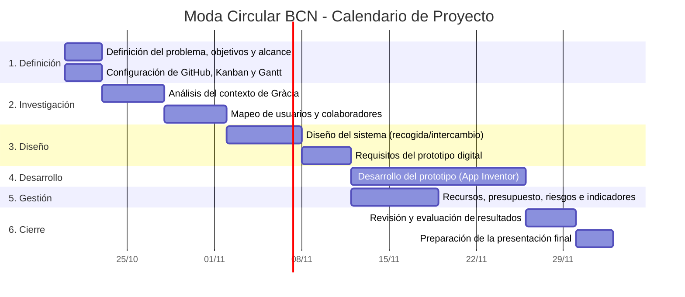

```mermaid
gantt
    title Moda Circular BCN - Calendario de Proyecto
    dateFormat  YYYY-MM-DD
    axisFormat  %d/%m
    
    section 1. Definición
    Definición del problema, objetivos y alcance :f1, 2026-10-20, 3d
    Configuración de GitHub, Kanban y Gantt      :f1b, 2026-10-20, 3d
    
    section 2. Investigación
    Análisis del contexto de Gràcia              :f2a, after f1, 5d
    Mapeo de usuarios y colaboradores            :f2b, after f2a, 5d
    
    section 3. Diseño
    Diseño del sistema (recogida/intercambio)    :f3a, after f2b, 6d
    Requisitos del prototipo digital             :f3b, after f3a, 4d
    
    section 4. Desarrollo
    Desarrollo del prototipo (App Inventor)      :f4, after f3b, 14d
    
    section 5. Gestión
    Recursos, presupuesto, riesgos e indicadores :f5, after f3b, 7d
    
    section 6. Cierre
    Revisión y evaluación de resultados          :f6a, after f4, 4d
    Preparación de la presentación final         :f6b, after f6a, 3d
```
